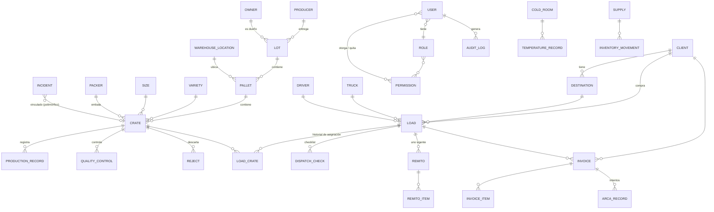
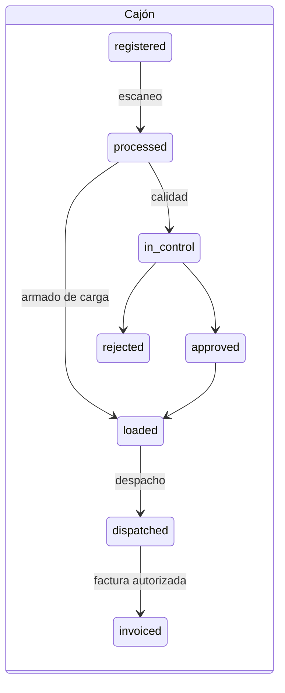
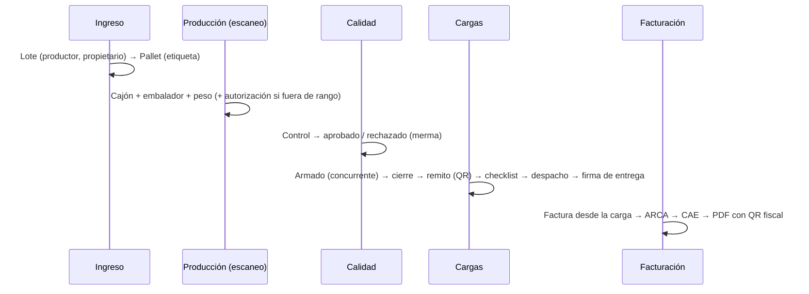

# Arquitectura

Ver también [CLAUDE.md](../CLAUDE.md) (reglas obligatorias de desarrollo).

## Capas

```
Navegador (Blade + Tailwind + Alpine)      Dispositivos (balanza, sensores)
        │  sesión + CSRF                           │  token Sanctum (habilidades)
        ▼                                          ▼
 routes/web.php → routes/modules/*.php      routes/api.php (/api/v1, siempre JSON)
        │  middleware: auth · active · password.fresh · kiosk · module:<x> · can:<permiso>
        ▼
 Controladores pequeños + Form Requests (validación)
        ▼
 Services (lógica de negocio, transacciones, locks, auditoría)
        ▼
 Modelos Eloquent (Auditable, HasStateHistory, BelongsToWarehouse) ─▶ MySQL / MariaDB
```

- **Gate::before**: módulo desactivado → denegado; usuario inactivo → denegado; super admin → permitido;
  resto → permiso del rol ± permisos individuales.
- **Módulos**: `ModuleService::CATALOG`. Un módulo apagado oculta el menú, da 404 por URL y anula sus permisos.

## Modelo de datos (principal)



Tablas transversales: `state_histories` (historial de estados de cajones, pallets, cargas, incidentes),
`audit_logs` (valor anterior/nuevo, usuario, IP), `system_errors` (códigos ERR-…), `sequences`
(numeración con bloqueo), `settings`, `modules`, `alerts`, `notifications`, `daily_closings`, `backups`,
`documents`, `costs`, `support_tickets`, `licenses`, `personal_access_tokens`.

## Estados

```mermaid
stateDiagram-v2
    direction LR
    Draft --> Closed : cerrar (con cajones)
    Closed --> Draft : reabrir (motivo; sin remito ni factura)
    Closed --> Dispatched : checklist completo + remito
    Dispatched --> Delivered : firma de entrega
    Draft --> Cancelled : cancelar (motivo)
```





Todo cambio de estado pasa por `StateTransitionService`: valida la transición, hace un UPDATE condicional
por estado + `version`, guarda el historial y audita.

## Concurrencia (por qué no se duplican datos)

| Riesgo | Protección |
|---|---|
| Dos operarios cargan el mismo cajón en dos cargas | UPDATE condicional `current_load_id IS NULL AND status IN (…)` + índice único `load_crates.active_crate_id` |
| Doble remito para la misma carga | Índice único `remitos.active_load_id` (se libera al anular) |
| Mismo cajón escaneado dos veces / reintento por corte de red | Código de cajón único + clave de idempotencia en `production_records` |
| Dos personas editan el mismo registro | Bloqueo optimista con columna `version` |
| Números de cajón, carga, remito, factura repetidos | `SequenceService` con `lockForUpdate` |
| Stock de insumos negativo por movimientos simultáneos | `lockForUpdate` sobre el insumo |
| Dos cierres del mismo día | Índice único (galpón, fecha) + bloqueo |
| Dos cambios de estado de un incidente a la vez | UPDATE condicional por estado anterior |
| Respaldos o restauraciones simultáneas | Cache lock |

## Flujo de un cajón (trazabilidad)



## Seguridad

- Contraseñas con bcrypt; recuperación con respuesta genérica (sin enumerar usuarios), enlace de un solo
  uso o contraseña temporal con cambio obligatorio; límites de intentos en login y recuperación.
- CSRF en todos los formularios; cabeceras de seguridad (`SecurityHeaders`); sesiones en base de datos con
  cierre remoto; usuario inactivo expulsado en el siguiente request.
- Autorización en cada ruta (`can:`) y por registro (policies); el portal filtra siempre por el
  cliente/propietario del usuario (registros ajenos → 404).
- Auditoría sin contraseñas ni tokens; logs y trazas mostrados con secretos enmascarados.
- Tokens de API hasheados, mostrados una sola vez, con habilidades y sin superar los permisos del dueño.
- Credenciales de base y certificados ARCA sólo en `.env`; backups con archivo de opciones temporal.
- Errores técnicos: el usuario ve un código `ERR-AAAAMMDD-XXXXX`; el detalle queda en `system_errors`.
- Opcional: restricción por IP de la LAN (middleware `lan:` y configuración de Apache).

## Estructura de carpetas

```
app/Services          Lógica de negocio (LoadService, ProductionService, InvoiceService, BackupService…)
app/Services/Arca     Gateway ARCA: simulación y WSFEv1
app/Catalogs          Definiciones declarativas de catálogos (un CRUD genérico para todos)
app/Http/Controllers  Por área: Admin, Catalogs, Production, Loads, Billing, Reports, Developer, Api/V1
routes/modules        Un archivo de rutas por módulo
resources/views       Blade por área + components/ (layout, tablas, formularios, tarjetas)
tests/Feature         Por área + Smoke/ScreensCrawlTest (recorre todas las pantallas con cada rol)
```
